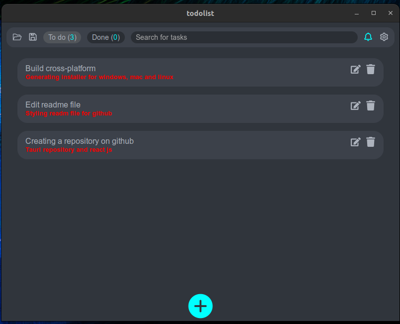

# Aplicação desktop - tauri + react
Um todo-list simples

## 🚀 Motivaçao / objetivo

Criar um aplicativo deskto multiplataforma usando react js e styled-components.
Um dos meus grandes motivos, além claro de codar foi mim aventurar a criar um aplicativo multiplataforma com tauri usando github-actions.
A minha inspiração foi esse video do youtube: [TodoList](https://www.youtube.com/watch?v=b0OcwnMZykE&t=1s).
Você pode visitar a documentação e verificar como tauri realiza algumas customizações mesclando códgio RUST com react js [Documentação](https://tauri.app/v1/guides/features/window-customization)

<h1 align="center">
    
</h1>

## 💻 Requisitos

Antes de iniciar, você deve ter o Node.js e o YARN instalados em sua máquina.

## 🚀 Instalando

Primeiro, você deve clonar o projeto na sua máquina, para isso você
pode colar o seguinte comando em seu terminal

```bash
git clone https://github.com/Tiago-Silva/tauri-todo-list.git
```
Para instalar as dependências, execute o seguinte comando:

```bash
yarn install
```

Por fim, para executar o projeto basta rodar o seguinte:

```bash
yarn tauri dev
```

## 🔧 Compilação

Para compilar a aplicação para produção, execute o seguinte comando:

```bash
yarn tauri build
```
Veja, isso funcionar diferente dependendo do seu ambiente de trabalho: windows, mac ou linux

### Features

Tecnologias usadas nesse projeto:

<!-- Ícones de tecnologias. Você pode encontrar esses ícones em sites como https://simpleicons.org/ -->
<div style="display: inline_block"><br/>
  
  
  
  
  
  
  <!-- Adicione mais ícones de tecnologias que você utiliza -->
</div><br/>

## 📝 Licença

Este projeto está licenciado sob a licença MIT. Consulte o arquivo `LICENSE` para obter mais informações.
